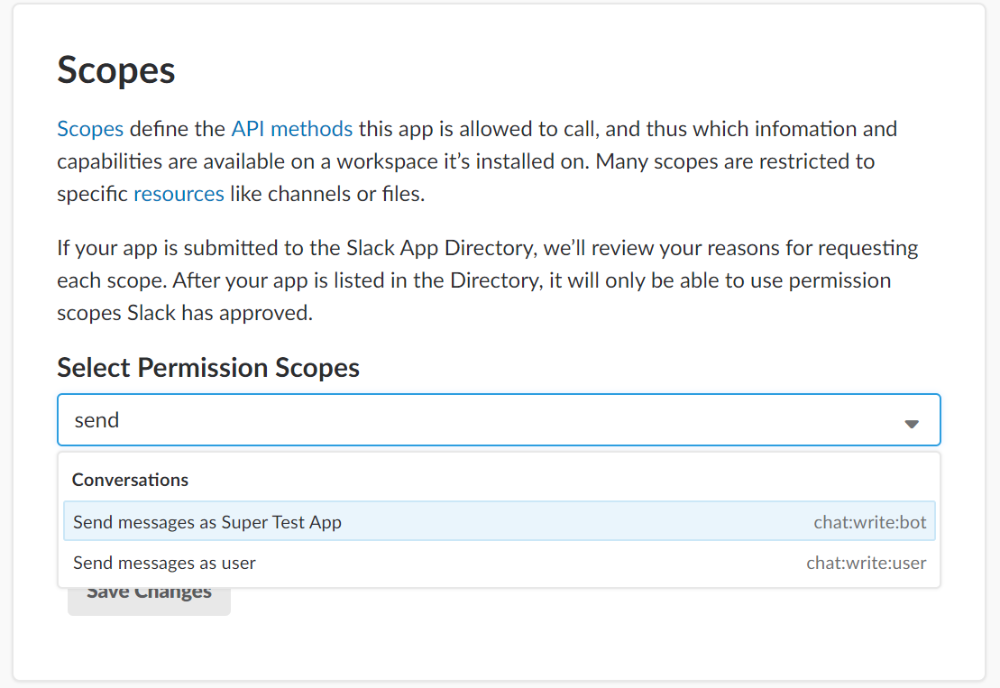
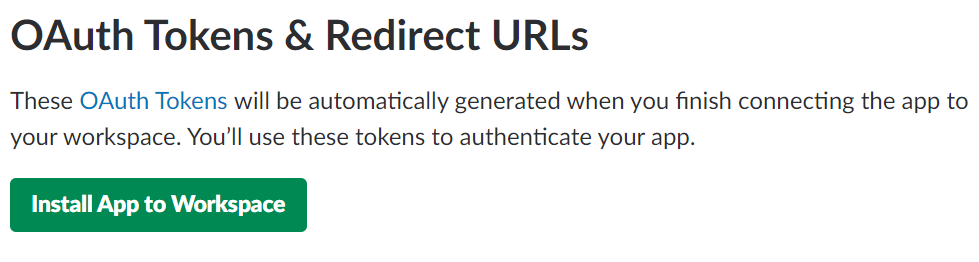
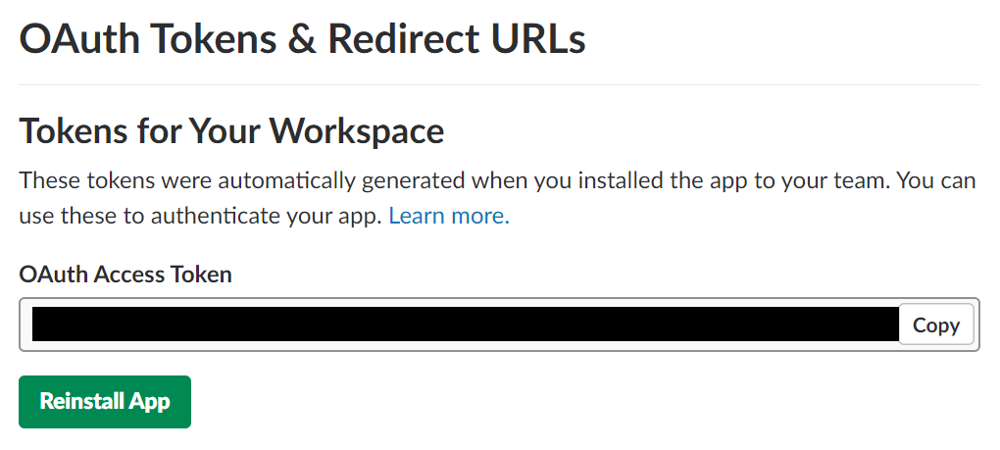
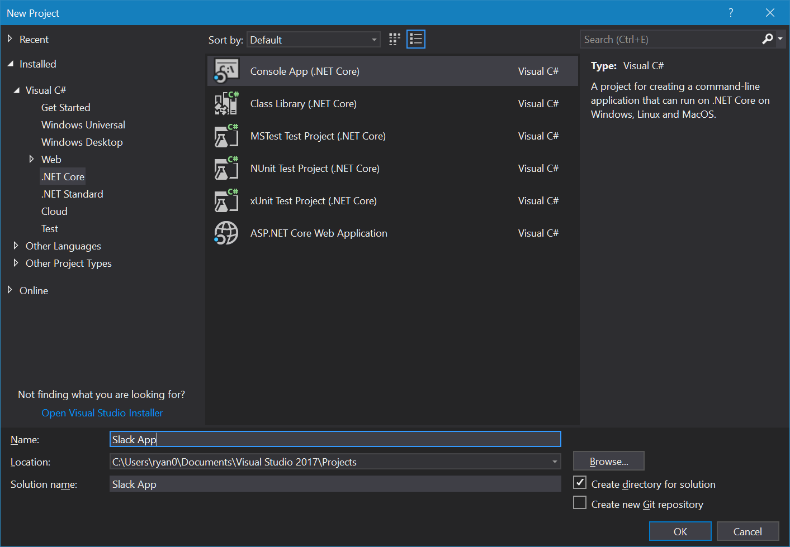
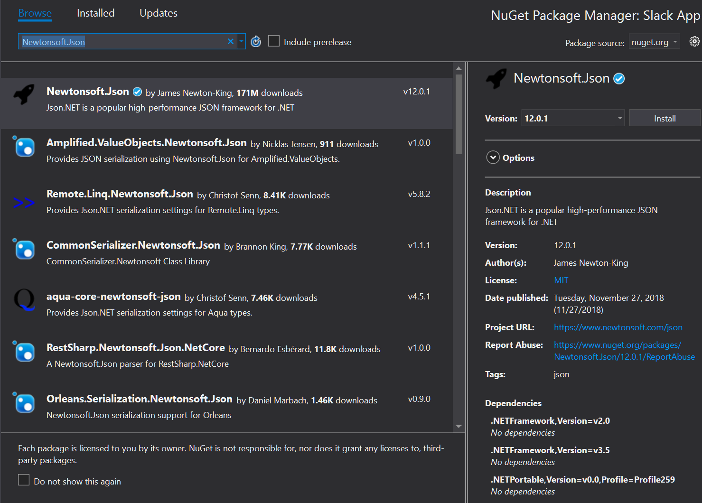
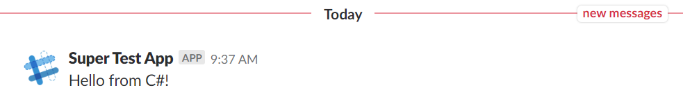

# Writing to a Slack Channel - .NET Edition
In this article, we’ll be creating a simple Node.js application that can write to a Slack channel. If you haven’t completed the first tutorial in this series where you learn about Slack’s APIs and create your first workspace and application, please do that first. (add link when posted)

To keep things nice and simple, we’re going to be using Slack’s Web API. This means that all we’ll need to be able to do to write to a Slack channel is make HTTP POST requests. Since this functionality is built into Node’s standard library, creating our app will be quick and easy.

## Getting Started
If you haven't installed it already, you'll need .NET Core 2.0 or newer. You can find installation instructions for Windows, MacOS, and Linux at https://dotnet.microsoft.com/download. We'll be covering how to create your app using either the terminal or Visual Studio, so no matter what your preference is, we've ot you covered.

To get started, we'll need to install our app into our Slack workspace, which will give us an access token we can use to post messages to channels in the workspace. Start by finding your app's admin page by navigating to the [Slack API apps page](https://api.slack.com/apps) and then clicking on your app in the the list that appears. 

When your app's admin page loads, click on 'OAuth and Permissions' in the menu on the left. When this page loads, scroll down to 'Scopes'. You'll need to add at least one scope before you'll be able to generate an access token. This makes sense, because without any authorized scopes, your app wouldn't be allowed to do anything, and an access token that grants you the ability to do nothing at all wouldn't be very useful! 

Click on the drop down box to see a lit of scopes you can add. The one you're looking for is 'Send messages as Super Amazing Test App', though instead of Super Amazing Test App, you'll see whatever super amazing name you gave your own application. It should look something like this:



Once you've added this scope, you'll be able to install the app to your workspace. Scroll back up to the top of the 'OAuth & Permissions' page, and you'll see a nice inviting green button you can click:



Click it, and you'll be taken to a screen asking you to give you app access to your workspace. Authorize it, and your OAuth & Permission page will now contain an access token:



Instead of a black box, you'll see your very own access token here. Kepe this open in a browser tab, because you're going to need this access token in a minute.

Now that we have the information we need, we can move on to writing the code that will make our app work.

## Project Setup
Here comes the fun part! Setting up the project will be a bit different depending on whether you're working in Visual Studio on Windows, or working in a terminal on any OS. In the next section, follow the instructions that apply to you, and then jump to the 'Everyone' section.

Note that the naming might be a little confusing. When we discuss 'Visual Studio' in the rest of this article, we'll be talking about Visual Studio for Windows. If you've used Visual Studio Code, keep in mind that it is a completely different app than Visual Studio. 

### **Visual Studio**
Start by opening up a frsh copy of Visual Studio 2017. Open the File menu, and choose New->Project. 

When the new project window opens, choose .NET Core in the menu on the left, and then select Console Application:



I've namd my application 'Slack App', but if you're feeling creative and you'd like to come up with a fancier name for yours, please do so.

Click 'OK', and Visual Studio will merrily create your console app.

We'll also need to add one NuGet package. In the tree view of your project, right click on 'Dependencies' and then choose 'Manage NuGet Packages'. Set your package source to nuget.org, and search Newtonsoft.Json. Install the newest version of this package:



### **Terminal**
First, open up a terminal or command prompt, and make a new directory for your app:
```
mkdir slack-app
```
Then change to the new directory, and run the command to create a new .NET Core console app:
```
cd slack-app
dotnet new console
```

When you run the `dotnet new console` command, the .NET Core CLI will generate a new console app for you.

We'll also need to add a NuGet package. From your `slack-app` directory, run:
```
dotnet add package Newtonsoft.Json
```
and you'll be ready to go. 

Now, open the directory in a text editor. Visual Studio Code is a free editor that works on Windows, MacOS, and Linux, and it’s a great choice if you’re not sure what to use. An Added benefit is that VS Code comes with great built-in support for .NET Core. But if you have another editor you already prefer to use for .NET Core, go right ahead and use it. 

### **Everyone**
This might all seem a little underwhelming. I mean, we're trying to create a super amazing Slack app, and we just created a simple console app? What gives?!

Although our app might seem too simple at this point, that's actually a good thing! The Slack API is designed to stay out of our way, and make easy things *really* easy.A Slack app with lots of functionality will be much larger and more complicated. But since we're only trying to do something simple, our app should be simple too.

## The Code

With your new console app open in your text editor or Visual Studio, the first thing we'll want to do is add a new class that will handle writing messages to slack. In your proejct directory, create a new file named SlackMessageWriter.cs and add the following content:
```
using System.Net.Http;
using System.Text;
using System.Threading.Tasks;
using Newtonsoft.Json;

namespace Slack_App
{
    class SlackMessageWriter
    {
        private readonly string _url;
        private readonly HttpClient _client;

        public SlackMessageWriter(string token)
        {
            _url = "https://slack.com/api/chat.postMessage";
            _client = new HttpClient();
            _client.DefaultRequestHeaders.Authorization =
                new System.Net.Http.Headers.AuthenticationHeaderValue("Bearer", token);
        }

        public async Task WriteMessage(string message)
        {
            var postObject = new { channel = "#general", text = message };
            var json = JsonConvert.SerializeObject(postObject);
            var content = new StringContent(json, Encoding.UTF8, "application/json");

            await _client.PostAsync(_url, content);
        }
    }
}
```
Our `SlackMessageWriter` is fairly straightforward. It receives a Slack access token in its constructor, and it uses this to create a new `HttpClient` with the access token set in the Authorization header. 

It also contains a `WriteMessage` method that receives a string that will be posted to the `#general` channel in your Slack workspace. This method creates a new object containing the channel and text properties that the Slack API requires us to provide. It then converts this object to JSON and adds it to a new instance of `StringContent`. 

Finally, the method makes a POST request to Slack and sends the content object that was just created. 

Next, open up the `Program.cs` file that was generated as part of your project. Modify the contents of the `Main` method so your program class looks like this:
```
using System;
using System.Threading.Tasks;

namespace Slack_App
{
    class Program
    {
        static void Main(string[] args)
        {
            string token = "your-token-goes-here";
            var writer = new SlackMessageWriter(token);
            Task.WaitAll(writer.WriteMessage("Hello from C#!"));
        }
    }
}
```
 There's one change you'll need to make to this code: the token string that currently says `your-token-goes-here`. Remember that access token we generated earlier when we installed the app in our workspace? This is where you'll want to put it. 

In a real, production-ready app, you'd want to store your app's secrets somewhere a little more secure than this; some people like to save secrets into an environment variables on the server where the app runs, and others use solutions like Kubernetes secrets or the AWS secrets manager.

Just remember not to commit your access token to a public GitHub repo, unless you want everyone in the world to know it. In our case, all that could happen would be that all of the world's trolls could gleefulyl post message to our Slack workspace. This wouldn't exactly be a huge security breach, but it would sure be annoying. 

We're now ready to run our application. If you're running Visual Studio, click the Run button. Otherwise, from a terminal in your project directory, run `dotnet run`. 

Now, if you look in the `#general` channel in your Slack workspace, you'll see this:


## We're all done!
And that's it! You've written your first Slack API app. That was pretty easy, wasn't it?

Now for the really good news: you can officially add 'Slack API Developer' to your LinkedIn profile, and look forward to an avalanche of messages from recruiters telling you that you're the perfect candidate for a role they're trying to fill. 


